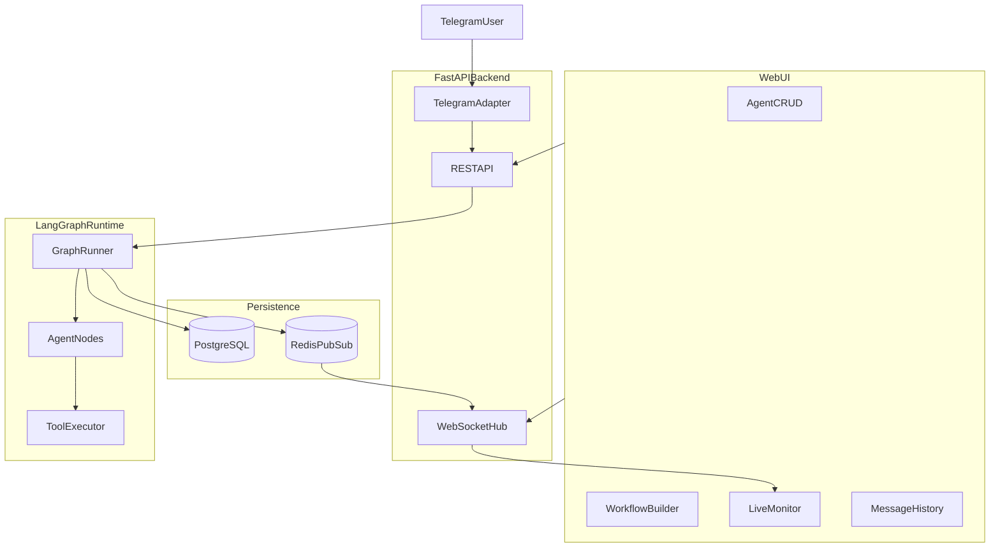

# Yuno AI Agent Orchestration Platform

A local-first platform for creating, configuring, and orchestrating multi-agent AI workflows. Built with **LangGraph** for runtime execution, **FastAPI** for the API layer, **React + React Flow** for the visual workflow builder, and **Telegram** for external human interaction.

## Problem → Solution

Teams need a single place to define agent behavior (personality, tools, memory, guardrails), compose agents into collaborative workflows with conditions and feedback loops, and observe execution in real time—including conversations from external messaging channels. This platform delivers that with a real LangGraph runtime (not a UI mockup), async inter-agent messaging, persisted history, and live monitoring.

## Architecture



### Three-layer separation

| Layer | Location | Responsibility |
|-------|----------|----------------|
| UI | `frontend/src/` | Agent CRUD, workflow canvas, monitoring dashboards |
| Runtime integration | `backend/app/runtime/`, `backend/app/channels/` | LangGraph graphs, graph repair, tools, Telegram adapter |
| Data | `backend/app/models/`, PostgreSQL, Redis | Persistence, message history, pub/sub events |

## Why LangGraph?

| Framework | Strength | Why we chose / didn't |
|-----------|----------|----------------------|
| **LangGraph** ✓ | Explicit graph state, conditional edges, feedback loops | Maps directly to visual workflow builder |
| CrewAI | Fast role-based setup | Less control over custom branching |
| AutoGen | Conversational multi-agent | Harder to visualize workflow structure |
| openclaw.ai | Always-on agents with SOUL.md | Better for personal agents than orchestration UI |

## Why Telegram?

| Channel | Demo reliability | Setup |
|---------|-----------------|-------|
| **Telegram** ✓ | High | Free BotFather token, polling works locally |
| Slack | Medium | Requires workspace app setup |
| WhatsApp | Low | Requires Meta Business API |

## Quick start (single command)

```bash
cp .env.example .env
# Edit .env: set OPENAI_API_KEY and TELEGRAM_BOT_TOKEN

docker compose up --build
```

| Service | URL |
|---------|-----|
| Web UI | http://localhost:5173 |
| API docs | http://localhost:8000/docs |
| Health | http://localhost:8000/health |

## Environment variables

| Variable | Required | Description |
|----------|----------|-------------|
| `OPENAI_API_KEY` | No | Only if `LLM_PROVIDER=openai` |
| `LLM_PROVIDER` | Yes for demo | `groq` recommended for submission; `mock` for local tests only |
| `LLM_MODEL` | No | Platform default model (e.g. `llama-3.1-8b-instant` for Groq) |
| `ENCRYPTION_KEY` | For per-agent keys | Fernet key for encrypting agent-specific API keys at rest |
| `ALLOW_MOCK_LLM_FALLBACK` | No | Default `false` — failed LLM calls fail the run (no silent mock) |
| `GROQ_API_KEY` | For Groq | Free tier at [console.groq.com](https://console.groq.com) |
| `OPENCODE_API_KEY` | For OpenCode Zen | Free models via [opencode.ai](https://opencode.ai/docs/zen/) |
| `OLLAMA_BASE_URL` | For Ollama | Default `http://host.docker.internal:11434` |
| `TELEGRAM_BOT_TOKEN` | For Telegram demo | From [@BotFather](https://t.me/BotFather) |
| `TELEGRAM_WORKFLOW_NAME` | No | Workflow name the Telegram bot executes (default: `Telegram Support Triage`) |
| `SCHEDULE_ENABLED` | No | Enable workflow cron scheduler (default: `true`) |
| `SCHEDULE_POLL_SECONDS` | No | How often to evaluate cron schedules (default: `60`) |
| `DATABASE_URL` | Auto in Docker | PostgreSQL connection string |
| `REDIS_URL` | Auto in Docker | Redis connection string |
| `TAVILY_API_KEY` | No | Better web search (falls back to DuckDuckGo) |

\* For demo submission use **Groq** with a real API key. Mock provider is for local tests only — the runtime does not silently fall back to mock during workflow execution.

## Demo workflows (pre-seeded templates)

### Template A: Quick Brief → Executive Summary

1. Open **Workflows** → select **Quick Brief → Executive Summary**
2. Click **Run Workflow** with input: `Benefits of multi-agent orchestration for customer support`
3. Optional: set **Schedule (cron, UTC)** (e.g. `*/5 * * * *`) and click **Save Graph** — manage jobs from the **Schedules** tab
4. Open **Live Monitor** — final executive summary appears in the top output card (~2 Groq calls, no review loop)

Agents page shows platform LLM defaults from `.env` and masked API key hints. Per-agent provider/model/key overrides are supported.

### Template B: Telegram Support Triage

1. Message your Telegram bot: `I have a billing question about my invoice`
2. Bot replies after triage → billing specialist → responder pipeline
3. Open **Message History** in the UI to see the persisted conversation

## Code walkthrough (recommended order)

1. `backend/app/models/__init__.py` — configurable agent/workflow data model
2. `backend/app/runtime/graph_builder.py` — workflow JSON → LangGraph compilation
3. `backend/app/runtime/tools.py` — real tool registry (search, files, messaging)
4. `backend/app/channels/telegram_adapter.py` — external channel adapter pattern
5. `frontend/src/components/WorkflowCanvas.tsx` — visual graph maps 1:1 to runtime

**Story arc:** configure → compose → execute → observe → converse

## Tests

```bash
cd backend
pip install -r requirements.txt
pytest
```

Critical paths covered:
- Agent CRUD (`tests/test_agents_api.py`)
- Workflow CRUD, run start, graph repair API (`tests/test_workflows_api.py`)
- Graph compilation (`tests/test_graph_builder.py`)
- Workflow execution + runtime messages (`tests/test_workflow_run.py`)
- Message delivery + Redis/WebSocket events (`tests/test_messaging.py`, `tests/test_events.py`)
- Telegram routing (`tests/test_telegram_adapter.py`)
- Workflow schedules + Schedules API (`tests/test_scheduler.py`, `tests/test_schedules_api.py`)

> Requires Python 3.11–3.13 (Docker backend uses Python 3.11).

## Tradeoffs

1. **LangGraph vs CrewAI** — explicit graph control for conditions/loops vs faster prototyping
2. **Postgres + JSON columns** — relational audit trail with flexible workflow definitions
3. **Redis pub/sub + WebSocket** — real-time UI without polling; Postgres remains source of truth
4. **No silent mock fallback** — real LLM errors fail the run; Groq 429s retry with backoff
5. **Guardrails in runtime** — token caps and tool allowlists enforced in `_apply_guardrails()`, not just UI
6. **Graph repair on the backend** — `graph_repair.py` + `/api/workflows/repair-graph` keep routing rules in one place for UI and runtime

## Documentation

- [Architecture deep dive](docs/ARCHITECTURE.md)
- [Add a workflow template](docs/ADD_WORKFLOW_TEMPLATE.md)
- [Add a messaging channel](docs/ADD_MESSAGING_CHANNEL.md)
