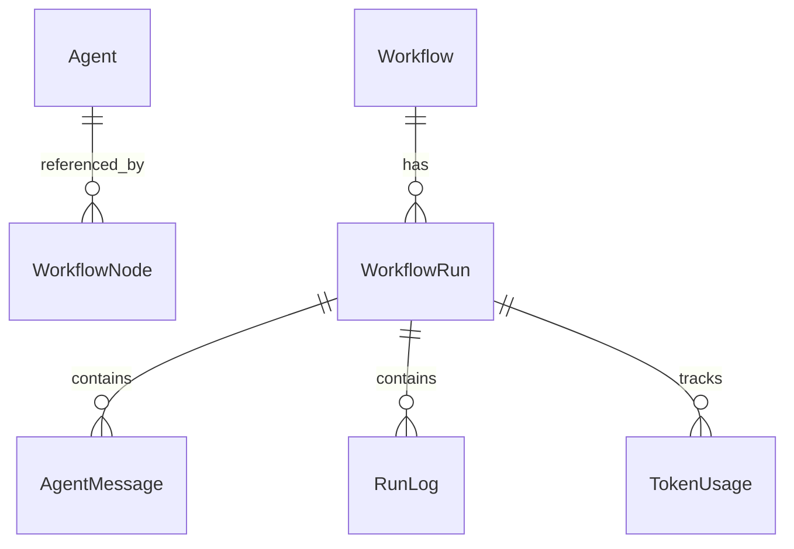
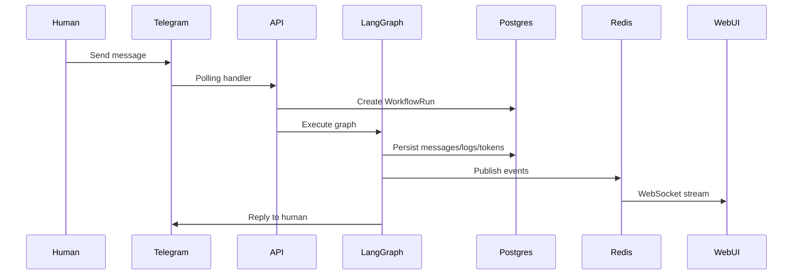

# Architecture Deep Dive

## System overview

The platform follows a strict three-layer architecture:

1. **Presentation (React)** — CRUD forms, React Flow workflow canvas, WebSocket-powered live monitor
2. **Orchestration (FastAPI + LangGraph)** — REST/WebSocket API, graph compilation/repair, async execution
3. **Data (PostgreSQL + Redis)** — durable storage + ephemeral pub/sub for real-time events

## Data model



### Agent configurable dimensions

| Field | Purpose |
|-------|---------|
| `name`, `role`, `system_prompt`, `model` | Identity and LLM config |
| `tools` | Enabled tools from registry |
| `channels` | External channel bindings (e.g. Telegram) |
| `memory_config` | Short-term / long-term memory flags |
| `skills` | Prompt modules appended to system prompt |
| `interaction_rules` | Rules for agent-to-agent behavior |
| `guardrails` | `max_tokens`, `allowed_tools`, `blocked_patterns` |

## LangGraph state schema

```python
class GraphState(TypedDict):
    input_text: str
    messages: list[dict]
    agent_outputs: dict[str, str]
    review_passed: bool
    triage_intent: str
    final_output: str
    channel_context: dict
```

Each node reads prior `agent_outputs`, writes its own output, and conditional edges route based on content (e.g. `REVIEW: PASS`, `INTENT: billing`).

## End-to-end message flow



## Guardrails enforcement

Guardrails are applied in `backend/app/runtime/graph_builder.py` via `_apply_guardrails()`:

- **Token cap** — truncates output exceeding `max_tokens`
- **Blocked patterns** — regex block list for unsafe content
- **Tool allowlist** — only permitted tools are bound to the LLM

This ensures guardrails cannot be bypassed by skipping the UI.

## Failure handling

- LLM API errors fail the run by default (`ALLOW_MOCK_LLM_FALLBACK=false`); set the env flag to enable deterministic mock fallback for local debugging only
- Workflow exceptions → run marked `failed`, error persisted and streamed
- Missing Telegram token → bot skipped, platform still starts

## Graph repair contract

Routing repair and sanitization live in `backend/app/runtime/graph_repair.py` and are exposed via `POST /api/workflows/repair-graph`. The web UI calls this endpoint before save/display so compile-time rules stay in one place.

## Workflow scheduler

Workflows with a cron expression in `graph_definition.schedule` run in the background (`backend/app/workers/scheduler.py`):

- Set **Schedule (cron, UTC)** and **Run Input** on the Workflows page, then click **Save Graph**
- Manage jobs from the **Schedules** tab: view workflow, cron, input, status, pause, resume, or delete
- Cron is evaluated in **UTC** (e.g. `*/5 * * * *` = every 5 minutes)
- `schedule.enabled` defaults to `true`; paused schedules keep their config but do not fire
- Delete from Schedules removes the cron job without deleting the workflow
- `schedule.input_text` is the same value as **Run Input** — used for both manual and scheduled runs
- Runs appear in Live Monitor / Message History like manual runs

Schedule API: `GET/PATCH/DELETE /api/schedules/{workflow_id}`

## Extension points

- New workflow templates: see [ADD_WORKFLOW_TEMPLATE.md](ADD_WORKFLOW_TEMPLATE.md)
- New messaging channels: see [ADD_MESSAGING_CHANNEL.md](ADD_MESSAGING_CHANNEL.md)
- New tools: add to `backend/app/runtime/tools.py` registry
